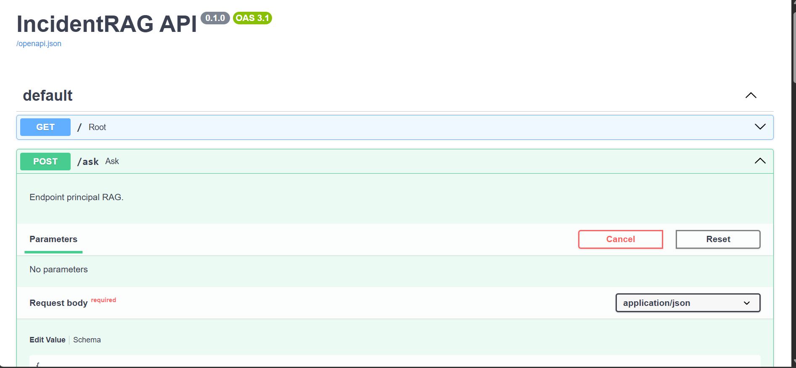
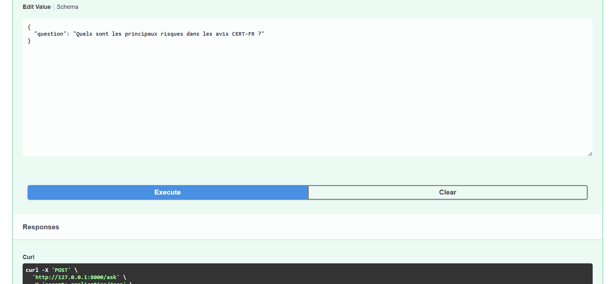
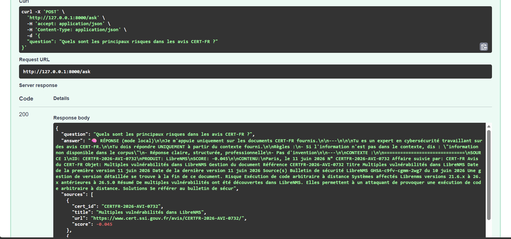
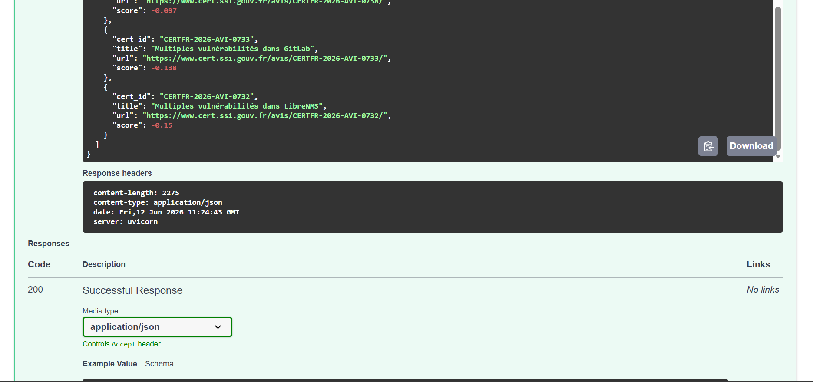
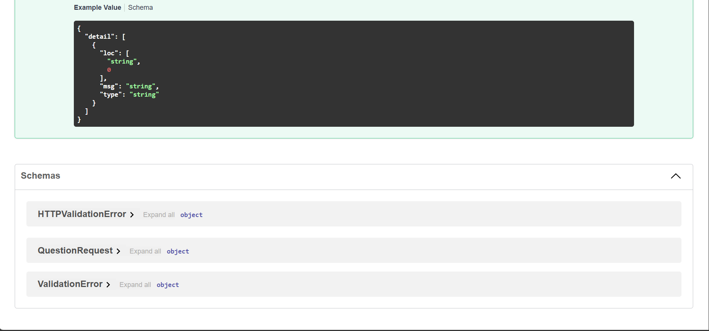

# IncidentRAG Analytics

## Présentation

**IncidentRAG Analytics** est un projet de pipeline RAG appliqué à un corpus d'avis de sécurité **CERT-FR**.

L'objectif du projet est de permettre à un utilisateur de poser une question sur des avis de sécurité, puis d'obtenir une réponse construite à partir des passages les plus pertinents retrouvés dans le corpus, avec les sources utilisées.

Le projet combine trois aspects :

* l'ingestion et le nettoyage d'un corpus CERT-FR ;
* la recherche vectorielle avec Chroma ;
* une interface de question-réponse avec sources, exposée via une API FastAPI et une interface web.

Le projet propose aussi une première analyse du corpus afin de faire ressortir des tendances : nombre de documents, nombre de chunks, produits les plus fréquents, répartition temporelle et volume de chunks par document.

---

## Projet choisi

**Projet B — IncidentRAG Analytics**

* **Corpus** : avis de sécurité CERT-FR
* **Vector store** : Chroma
* **API** : FastAPI
* **Embeddings** : `sentence-transformers/all-MiniLM-L6-v2`
* **Interface** : page web intégrée à FastAPI

---

## Équipe

* Rizlene Berrag
* Franck Joel Nzokou

---

## Répartition des rôles

| Membre             | Rôle principal                              | Missions                                                                                                                                                 |
| ------------------ | ------------------------------------------- | -------------------------------------------------------------------------------------------------------------------------------------------------------- |
| Rizlene Berrag     | R1 Data / Ingestion + R4 DevOps / Analytics | Récupération du corpus, nettoyage HTML, extraction des métadonnées, génération des chunks, analyse du corpus, Docker, interface et finalisation du rendu |
| Franck Joel Nzokou | R2 Embeddings / Index + R3 Retrieval / LLM  | Génération des embeddings, indexation Chroma, recherche des chunks pertinents, structure de l'API RAG                                                    |

---

## Fonctionnalités principales

* récupération d'avis CERT-FR ;
* extraction du texte utile depuis les fichiers HTML ;
* nettoyage du contenu ;
* extraction de métadonnées : identifiant CERT-FR, titre, date, produit, systèmes affectés, risques, URL ;
* découpage du corpus en chunks ;
* génération d'un fichier `corpus/chunks.jsonl` ;
* génération d'embeddings avec Sentence Transformers ;
* stockage des vecteurs dans Chroma ;
* recherche des passages les plus pertinents selon une question utilisateur ;
* génération d'une réponse structurée avec sources ;
* endpoint API `POST /ask` ;
* interface web de démonstration ;
* analyse du corpus avec exports JSON/CSV et graphiques.

---

## Architecture du pipeline

```txt
Avis CERT-FR
    ↓
scripts/fetch_corpus.ps1
    ↓
corpus/raw/
    ↓
app/ingest.py
    ↓
corpus/chunks.jsonl
    ↓
app/embed.py
    ↓
ChromaDB
    ↓
app/retrieve.py
    ↓
app/generate.py
    ↓
app/api.py
    ↓
Interface web + POST /ask
```

---

## Structure du projet

```txt
incidentrag-analytics/
├── README.md
├── Dockerfile
├── docker-compose.yml
├── .dockerignore
├── .env.example
├── .gitignore
├── requirements.txt
│
├── scripts/
│   ├── fetch_corpus.ps1
│   └── fetch_corpus.sh
│
├── corpus/
│   ├── raw/
│   ├── seed/
│   └── chunks.jsonl
│
├── app/
│   ├── __init__.py
│   ├── ingest.py
│   ├── embed.py
│   ├── store.py
│   ├── retrieve.py
│   ├── generate.py
│   ├── api.py
│   ├── metrics.py
│   └── static/
│       └── index.html
│
├── analytics/
│   ├── clustering.py
│   ├── plots.py
│   ├── trends.py
│   └── results/
│
└── docs/
    ├── COMPTE-RENDU.md
    └── figures/
```

---

## Technologies utilisées

* Python
* FastAPI
* Uvicorn
* ChromaDB
* Sentence Transformers
* Scikit-learn
* Matplotlib
* Pandas
* Docker
* Docker Compose
* HTML / CSS / JavaScript
* Git / GitHub

---

## Installation locale

### 1. Cloner le projet

```bash
git clone https://github.com/RizleneBERRAG/incidentrag-analytics.git
cd incidentrag-analytics
```

### 2. Installer les dépendances

```bash
pip install -r requirements.txt
```

### 3. Configurer les variables d'environnement

Copier le fichier d'exemple :

```bash
cp .env.example .env
```

Sous PowerShell :

```powershell
Copy-Item .env.example .env
```

---

## Variables d'environnement principales

```env
CHROMA_HOST=localhost
CHROMA_PORT=8001
CHROMA_COLLECTION=rag_chunks

CHUNKS_PATH=corpus/chunks.jsonl
EMBEDDING_MODEL=sentence-transformers/all-MiniLM-L6-v2
EMBEDDING_BATCH_SIZE=64

TOP_K=5
SIMILARITY_THRESHOLD=0.55
```

---

## Utilisation locale

### 1. Générer ou mettre à jour le corpus

```bash
python -m app.ingest
```

Cette commande lit les fichiers HTML présents dans `corpus/raw/` et génère :

```txt
corpus/chunks.jsonl
```

### 2. Lancer Chroma avec Docker

```bash
docker compose up -d chroma
```

### 3. Indexer les chunks dans Chroma

```bash
python -m app.embed
```

Cette commande génère les embeddings et indexe les chunks dans Chroma.

### 4. Tester la recherche

```bash
python -m app.retrieve
```

### 5. Tester la génération de réponse

```bash
python -m app.generate
```

### 6. Lancer l'API

```bash
python -m uvicorn app.api:app --reload
```

L'API est disponible sur :

```txt
http://127.0.0.1:8000
```

La documentation Swagger est disponible sur :

```txt
http://127.0.0.1:8000/docs
```

---

## Lancement avec Docker Compose

Le projet contient un `Dockerfile` et un `docker-compose.yml`.

### Lancer les services

```bash
docker compose up --build
```

### Indexer les chunks depuis Docker

Si la base Chroma est vide, lancer :

```bash
docker compose run --rm api python -m app.embed
```

### Accéder à l'interface

```txt
http://127.0.0.1:8000
```

---

## Interface web

Le projet propose une interface web intégrée à FastAPI.

Elle permet de :

* poser une question au système RAG ;
* envoyer la question à l'endpoint `POST /ask` ;
* afficher la réponse générée ;
* afficher les sources CERT-FR utilisées ;
* tester rapidement plusieurs questions prédéfinies.

Fichier concerné :

```txt
app/static/index.html
```

---

## Endpoint principal

### `POST /ask`

Exemple de requête :

```json
{
  "question": "Quelles vulnérabilités concernent Microsoft Windows ?"
}
```

Exemple de réponse :

```json
{
  "question": "Quelles vulnérabilités concernent Microsoft Windows ?",
  "answer": "D'après les avis CERT-FR retrouvés dans le corpus...",
  "sources": [
    {
      "id": "CERTFR-2026-AVI-0728_chunk_000",
      "cert_id": "CERTFR-2026-AVI-0728",
      "title": "Multiples vulnérabilités dans Microsoft Windows",
      "date": "10 juin 2026",
      "product": "Microsoft Windows",
      "url": "https://www.cert.ssi.gouv.fr/avis/CERTFR-2026-AVI-0728/",
      "score": 0.5351,
      "excerpt": "Paris, le 10 juin 2026..."
    }
  ]
}
```

---

## Exemples de questions

```txt
Quelles vulnérabilités concernent Microsoft Windows ?
```

```txt
Quels produits Microsoft apparaissent dans le corpus ?
```

```txt
Quels sont les risques mentionnés dans les avis CERT-FR ?
```

```txt
Quels systèmes sont affectés par les vulnérabilités Microsoft .Net ?
```

---

## Résultats obtenus

Sur le corpus testé :

* **10 documents CERT-FR analysés**
* **226 chunks générés**
* **embeddings générés avec `all-MiniLM-L6-v2`**
* **indexation Chroma fonctionnelle**
* **recherche sémantique validée**
* **réponse avec sources via `POST /ask`**
* **interface web fonctionnelle**

Exemple de recherche validée :

```txt
Question :
Quelles vulnérabilités concernent Microsoft Windows ?

Résultat pertinent :
CERTFR-2026-AVI-0728 — Multiples vulnérabilités dans Microsoft Windows
```

---

## Analyse du corpus

Le script suivant produit une première analyse :

```bash
python -m analytics.clustering
```

Il génère notamment :

```txt
analytics/results/summary.json
analytics/results/top_products.csv
analytics/results/documents_by_month.csv
analytics/results/documents_by_year.csv
analytics/results/chunks_by_document.csv
docs/figures/top_products.png
docs/figures/chunks_by_document.png
```

Cette analyse permet d'identifier :

* les produits les plus présents ;
* la répartition des avis par mois ;
* le nombre de chunks par document ;
* les documents les plus volumineux.

---

## Limites connues

Le projet est un MVP fonctionnel.

La génération de réponse repose principalement sur les passages retrouvés par le moteur de recherche vectorielle. Le système construit une réponse structurée avec les extraits pertinents et les sources, sans dépendre obligatoirement d'une API LLM externe.

Cette approche permet d'avoir une démonstration stable, gratuite et reproductible, mais les réponses restent moins naturelles qu'avec un grand modèle de langage connecté.

Axes d'amélioration possibles :

* brancher un LLM externe ou local ;
* améliorer le nettoyage sémantique des chunks ;
* enrichir les métadonnées ;
* améliorer le scoring des sources ;
* ajouter des tests automatisés ;
* ajouter une persistance plus avancée de l'historique des questions.

---

## Licence des données

Les avis CERT-FR utilisés dans ce projet proviennent de données publiques mises à disposition par le CERT-FR.

Le corpus seed est utilisé dans un cadre pédagogique.

---

## État final

Le projet dispose d'un pipeline complet et démontrable :

```txt
Ingestion → Chunks → Embeddings → Chroma → Retrieval → Réponse avec sources → API → Interface web
```

Le rendu final peut être lancé en local ou via Docker Compose.


##  Démonstration du système RAG

L’API FastAPI permet d’interroger le système RAG en temps réel.

---

###  1. Vérification de l’API

Le service est bien lancé et accessible :



---

###  2. Requête utilisateur (POST /ask)

Une question est envoyée au système :



---

###  3. Réponse générée par le système RAG

Le système retourne une réponse basée sur le corpus CERT-FR avec les sources associées :







---

 Cela démontre le bon fonctionnement complet du pipeline :
ingestion → embeddings → retrieval → génération → API