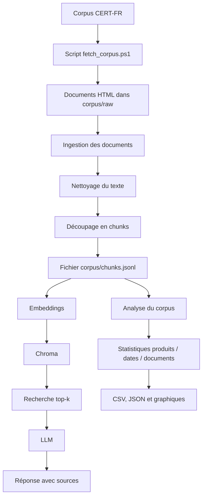

# Compte rendu - Projet B : IncidentRAG Analytics

## 1. Présentation

**Équipe** : Rizlene Berrag et Franck Joel Nzokou

**Membres et rôles** :

* Rizlene Berrag - R1 Data / Ingestion
* Franck Joel Nzokou - R2 Embeddings / Index
* Franck Joel Nzokou - R3 Retrieval / LLM
* Rizlene Berrag - R4 DevOps / Analytics

**Projet** : B - IncidentRAG Analytics
**Vector store** : Chroma
**Dépôt GitHub** : https://github.com/RizleneBERRAG/incidentrag-analytics

---

## 2. Objectif

Notre projet consiste à créer un RAG analytique capable d'interroger un corpus d'avis de sécurité CERT-FR.

L'application doit permettre à un utilisateur de poser une question sur des vulnérabilités ou incidents de sécurité. Le système recherche alors les passages les plus pertinents dans le corpus, puis génère une réponse avec les sources utilisées.

En plus de la question/réponse classique, le projet doit proposer une analyse globale du corpus. Cette analyse doit permettre d'identifier des tendances, comme les produits ou éditeurs les plus souvent concernés, les catégories de risques les plus fréquentes ou les thèmes principaux des avis.

L'objectif est donc double :

* fournir une réponse contextualisée à partir des documents ;
* extraire une vue d'ensemble du corpus pour mieux comprendre les incidents de sécurité.

---

## 3. Architecture



L'architecture possède deux sorties principales :

* une sortie RAG Q/R pour répondre aux questions avec sources ;
* une sortie analytique pour analyser l'ensemble du corpus.

La partie RAG utilise les chunks générés à partir des avis CERT-FR. Ces chunks sont ensuite destinés à être transformés en embeddings puis stockés dans Chroma.

La partie analytique exploite les métadonnées extraites pendant l'ingestion afin de produire des indicateurs simples : nombre de documents, nombre de chunks, produits les plus fréquents, répartition temporelle et documents les plus volumineux.

---

## 4. Fonctionnement

### Parcours d'une question RAG

1. L'utilisateur envoie une question à l'API via `POST /ask`.
2. La question est transformée en embedding.
3. Le système cherche dans Chroma les chunks les plus proches de la question.
4. Les meilleurs passages sont envoyés au LLM comme contexte.
5. Le LLM génère une réponse basée uniquement sur les passages récupérés.
6. La réponse est retournée avec les sources utilisées.

### Parcours d'une analyse

1. Les documents CERT-FR sont récupérés avec le script `scripts/fetch_corpus.ps1`.
2. Les fichiers HTML sont stockés localement dans `corpus/raw/`.
3. Le script `app/ingest.py` lit les fichiers HTML.
4. Le contenu est nettoyé afin d'enlever les éléments de navigation inutiles.
5. Les documents sont découpés en chunks.
6. Chaque chunk reçoit des métadonnées : identifiant CERT-FR, titre, année, date, produit, systèmes affectés, source et URL.
7. Le fichier `corpus/chunks.jsonl` est généré.
8. Le script `analytics/clustering.py` lit les chunks et produit une première analyse.
9. Les résultats sont exportés en CSV, JSON et graphiques PNG.

---

## 5. Structure du projet

```txt
incidentrag-analytics/
├── analytics/
│   ├── clustering.py              # Analyse du corpus et génération de résultats
│   └── results/
│       ├── summary.json           # Résumé global de l'analyse
│       ├── top_products.csv       # Produits les plus fréquents
│       ├── documents_by_month.csv # Répartition des avis par mois
│       ├── documents_by_year.csv  # Répartition des avis par année
│       └── chunks_by_document.csv # Nombre de chunks par avis
│
├── app/
│   ├── ingest.py                  # Préparation, nettoyage et découpage du corpus
│   ├── embed.py                   # Génération des embeddings
│   ├── store.py                   # Adaptateur Chroma
│   ├── retrieve.py                # Recherche des chunks pertinents
│   ├── generate.py                # Génération de réponse avec le LLM
│   ├── api.py                     # API FastAPI avec endpoint POST /ask
│   └── metrics.py                 # Mesures de performance
│
├── corpus/
│   ├── raw/                       # Corpus téléchargé localement, non committé
│   ├── seed/                      # Corpus seed fourni par le TP, committé
│   └── .gitkeep
│
├── docs/
│   ├── COMPTE-RENDU.md            # Compte rendu du projet
│   └── figures/
│       ├── top_products.png
│       └── chunks_by_document.png
│
├── scripts/
│   └── fetch_corpus.ps1           # Script de récupération du corpus CERT-FR
│
├── .env.example
├── .gitignore
├── docker-compose.yml
├── requirements.txt
└── README.md
```

---

## 6. Choix techniques

| Choix                                   | Valeur retenue                                                       | Justification                                                                  |
| --------------------------------------- | -------------------------------------------------------------------- | ------------------------------------------------------------------------------ |
| Modèle embeddings                       | all-MiniLM-L6-v2                                                     | Modèle local léger, adapté au TP, avec des vecteurs de dimension 384           |
| Vector store                            | Chroma                                                               | Vector store demandé pour le Projet B, simple à utiliser avec Python           |
| Métadonnées extraites du corpus CERT-FR | cert_id, titre, année, date, produit, systèmes affectés, source, URL | Ces informations facilitent la recherche, les citations et l'analyse du corpus |
| Méthode d'analyse                       | Comptage par produit, mois et document                               | Première analyse simple et exploitable rapidement pour le rendu                |
| Méthode de clustering                   | KMeans                                                               | Prévu pour la suite afin de regrouper les chunks par thèmes                    |
| LLM                                     | À compléter                                                          | Le choix dépendra de l'API gratuite disponible pendant le TP                   |

---

## 7. Résultats / métriques

### Qualité et exploitation RAG

La partie RAG complète dépend de l'indexation dans Chroma et de la génération LLM, qui seront finalisées dans les rôles R2 et R3.

| Métrique                     | Valeur                                   |
| ---------------------------- | ---------------------------------------- |
| Score similarité moyen top-k | À compléter après indexation Chroma      |
| Latence p50 / p95            | À compléter après mise en place de l'API |
| Tokens moyens                | À compléter après intégration du LLM     |

### Analytique

Une première analyse du corpus CERT-FR a été réalisée à partir des chunks générés par le pipeline d'ingestion.

| Analyse                          | Résultat                                                                                                                                                        |
| -------------------------------- | --------------------------------------------------------------------------------------------------------------------------------------------------------------- |
| Nombre de documents analysés     | 10 avis CERT-FR                                                                                                                                                 |
| Nombre de chunks générés         | 226 chunks                                                                                                                                                      |
| Top produits / éditeurs affectés | Typo3, Stormshield Network Security, Ivanti, Fortinet, Microsoft Edge, Microsoft Office, Microsoft Windows, Microsoft .Net, Microsoft Azure, produits Microsoft |
| Tendance des avis par mois       | 10 avis en 2026-06                                                                                                                                              |
| Documents les plus volumineux    | CERTFR-2026-AVI-0731 : 101 chunks ; CERTFR-2026-AVI-0728 : 60 chunks ; CERTFR-2026-AVI-0726 : 22 chunks                                                         |

Les résultats détaillés ont été exportés dans le dossier `analytics/results/` :

* `summary.json`
* `top_products.csv`
* `documents_by_month.csv`
* `documents_by_year.csv`
* `chunks_by_document.csv`

Deux graphiques ont également été générés dans le dossier `docs/figures/` :

* `top_products.png`
* `chunks_by_document.png`

Ces résultats permettent d'avoir une première vue d'ensemble du corpus, notamment sur les produits concernés et la taille des avis CERT-FR analysés.

---

## 8. Difficultés et limites

Plusieurs difficultés ont été rencontrées pendant la mise en place de la partie Data / Ingestion et Analytics.

La première difficulté concernait l'encodage des fichiers HTML récupérés depuis le site CERT-FR. Les caractères accentués apparaissaient parfois de manière incorrecte dans PowerShell avec `Get-Content`. Une vérification avec Python a permis de confirmer que les fichiers générés étaient bien lisibles en UTF-8.

La deuxième difficulté était liée au nettoyage du contenu HTML. Les premières versions de l'ingestion récupéraient également le menu du site, les liens de navigation et les flux RSS. Le script a donc été amélioré afin de conserver principalement le contenu utile des avis CERT-FR : référence, titre, date, objet, systèmes affectés et informations liées à l'avis.

Une autre limite concerne l'extraction automatique des métadonnées. Certaines informations comme les risques ou les produits affectés peuvent varier selon la structure des avis. L'extraction actuelle fonctionne sur les premiers avis testés, mais pourrait être améliorée avec des règles plus précises.

Enfin, l'analyse reste une première approche simple. Elle permet de compter les produits, les documents et les chunks, mais le clustering thématique complet devra être enrichi avec les embeddings et l'indexation Chroma.

---

## 9. Bonus - Tendances temporelles approfondies

Cette partie pourra être complétée si le temps le permet.

L'idée serait d'étendre l'analyse temporelle afin d'étudier l'évolution des avis CERT-FR sur plusieurs mois. Pour l'instant, le test a été réalisé sur 10 avis récents, tous datés de juin 2026.

Une amélioration possible serait d'augmenter le nombre d'avis récupérés afin d'obtenir une tendance plus représentative sur plusieurs mois.

---

## 10. Bonus - Monitoring de l'analyse en continu

Cette partie pourra être complétée si le temps le permet.

Une piste d'amélioration serait de relancer régulièrement le script de récupération du corpus afin de détecter l'apparition de nouveaux avis CERT-FR.

Le monitoring pourrait permettre de suivre :

* le nombre de nouveaux avis ;
* les produits les plus touchés ;
* les catégories de risques les plus fréquentes ;
* l'évolution du volume documentaire ;
* la latence moyenne du pipeline RAG.

---

## 11. Bonus - Pistes d'amélioration

Plusieurs pistes d'amélioration sont possibles :

* améliorer l'extraction des risques ;
* exploiter davantage les fichiers JSON CERT-FR lorsqu'ils sont disponibles ;
* augmenter le volume du corpus ;
* ajouter un vrai clustering thématique avec KMeans ;
* nommer automatiquement les clusters avec le LLM ;
* ajouter un tableau de bord analytique ;
* améliorer le prompt anti-hallucination ;
* ajouter un seuil de similarité pour refuser de répondre lorsque les sources sont insuffisantes ;
* ajouter des tests automatisés sur l'ingestion et la recherche ;
* améliorer la documentation de lancement du projet.
