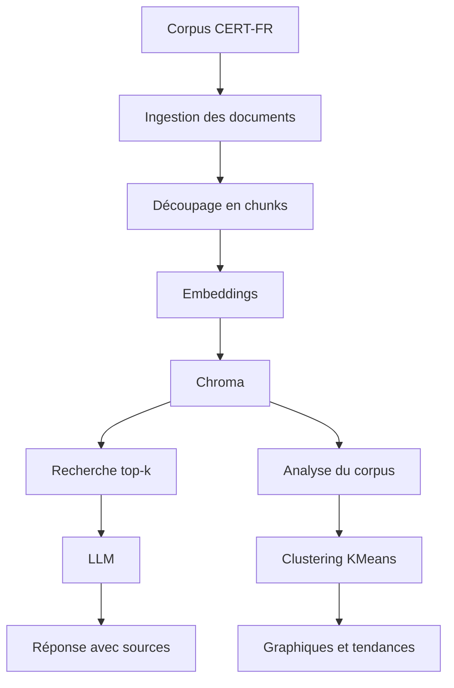

# Compte rendu - Projet B : IncidentRAG Analytics

## 1. Présentation

**Équipe** : Rizlene Berrag et Franck Joel Nzokou

**Membres et rôles** :

* Rizlene Berrag - R1 Data / Ingestion
* Franck Joel Nzokou - R2 Embeddings / Index
* Franck Joel Nzokou - R3 Retrieval / LLM
* Rizlene Berrag - R4 DevOps / Analytics

**Projet** : B - IncidentRAG Analytics
**Vector store** : Chroma
**Dépôt GitHub** : https://github.com/___

---

## 2. Objectif

Notre projet consiste à créer un RAG analytique capable d'interroger un corpus d'avis de sécurité CERT-FR.

L'application doit permettre à un utilisateur de poser une question sur des vulnérabilités ou incidents de sécurité. Le système recherche alors les passages les plus pertinents dans le corpus, puis génère une réponse avec les sources utilisées.

En plus de la question/réponse classique, le projet doit proposer une analyse globale du corpus. Cette analyse doit permettre d'identifier des tendances, comme les produits ou éditeurs les plus souvent concernés, les catégories de risques les plus fréquentes ou les thèmes principaux des avis.

---

## 3. Architecture



L'architecture possède deux sorties principales :

* une sortie RAG Q/R pour répondre aux questions avec sources ;
* une sortie analytique pour analyser l'ensemble du corpus.

---

## 4. Fonctionnement

### Parcours d'une question RAG

1. L'utilisateur envoie une question à l'API via `POST /ask`.
2. La question est transformée en embedding.
3. Le système cherche dans Chroma les chunks les plus proches de la question.
4. Les meilleurs passages sont envoyés au LLM comme contexte.
5. Le LLM génère une réponse basée uniquement sur les passages récupérés.
6. La réponse est retournée avec les sources utilisées.

### Parcours d'une analyse

1. Les documents CERT-FR sont récupérés et préparés.
2. Les textes sont découpés en chunks.
3. Les chunks sont vectorisés puis stockés dans Chroma.
4. Les métadonnées sont exploitées pour identifier les produits, dates ou catégories.
5. Les embeddings peuvent être regroupés avec KMeans.
6. Les résultats sont affichés sous forme de tableaux ou graphiques.

---

## 5. Structure du projet

```txt
incidentrag-analytics/
├── app/
│   ├── ingest.py       # Préparation et découpage du corpus
│   ├── embed.py        # Génération des embeddings
│   ├── store.py        # Adaptateur Chroma
│   ├── retrieve.py     # Recherche des chunks pertinents
│   ├── generate.py     # Génération de réponse avec le LLM
│   ├── api.py          # API FastAPI avec endpoint POST /ask
│   └── metrics.py      # Mesures de performance
│
├── analytics/
│   └── clustering.py   # Analyse du corpus et clustering
│
├── corpus/
│   └── .gitkeep        # Dossier local du corpus
│
├── docs/
│   └── COMPTE-RENDU.md # Compte rendu du projet
│
├── scripts/
│   └── fetch_corpus.ps1 # Script de récupération du corpus
│
├── .env.example
├── .gitignore
├── docker-compose.yml
├── requirements.txt
└── README.md
```

---

## 6. Choix techniques

| Choix                                 | Valeur retenue                            | Justification                                                        |
| ------------------------------------- | ----------------------------------------- | -------------------------------------------------------------------- |
| Modèle embeddings                     | all-MiniLM-L6-v2                          | Modèle local léger, adapté au TP, avec des vecteurs de dimension 384 |
| Vector store                          | Chroma                                    | Vector store demandé pour le Projet B, simple à utiliser avec Python |
| Métadonnées extraites du JSON CERT-FR | titre, date, produit, catégorie, sévérité | Ces informations permettent de faire l'analyse du corpus             |
| Méthode de clustering                 | KMeans                                    | Méthode simple pour regrouper automatiquement les chunks proches     |
| LLM                                   | À compléter                               | Le choix dépendra de l'API gratuite disponible pendant le TP         |

---

## 7. Résultats / métriques

### Qualité et exploitation RAG

| Métrique                     | Valeur      |
| ---------------------------- | ----------- |
| Score similarité moyen top-k | À compléter |
| Latence p50 / p95            | À compléter |
| Tokens moyens                | À compléter |

### Analytique

| Analyse                          | Résultat    |
| -------------------------------- | ----------- |
| Top produits / éditeurs affectés | À compléter |
| Clusters thématiques découverts  | À compléter |
| Tendance des avis par mois       | À compléter |

Les graphiques matplotlib seront ajoutés lorsque l'analyse du corpus sera réalisée.

---

## 8. Difficultés et limites

Difficultés prévues ou rencontrées :

* comprendre la structure des fichiers CERT-FR ;
* extraire correctement les métadonnées utiles ;
* choisir le bon nombre de clusters pour KMeans ;
* éviter que le LLM invente une réponse non présente dans les sources ;
* mesurer correctement la latence et la qualité du retrieval.

---

## 9. Bonus - Tendances temporelles approfondies

À compléter si le temps le permet.

---

## 10. Bonus - Monitoring de l'analyse en continu

À compléter si le temps le permet.

---

## 11. Bonus - Pistes d'amélioration

Pistes possibles :

* améliorer le nettoyage des données ;
* tester plusieurs valeurs de KMeans ;
* nommer automatiquement les clusters avec le LLM ;
* ajouter un tableau de bord analytique ;
* améliorer le prompt anti-hallucination.
